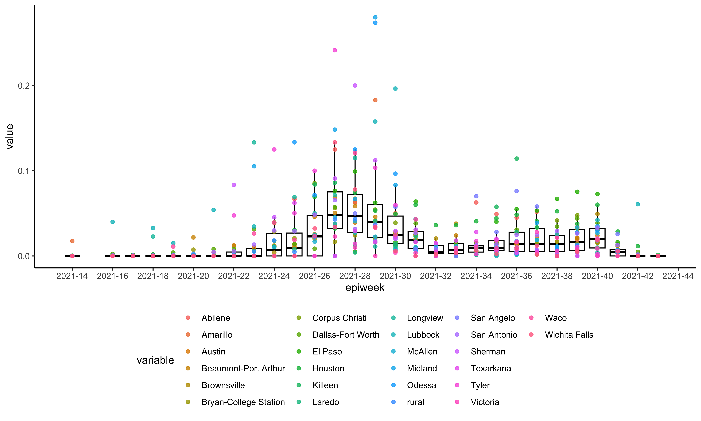

<!-- README.md is generated from README.Rmd. Please edit that file -->

# subsamplerr

<!-- badges: start -->
<!-- badges: end -->

R package for subsampling genomic data based on epidemiological time
series data.

## Installation

You can install the development version of subsamplerr from GitHub with:

``` r
devtools::install_github("leke-lyu/subsamplerr")
```

## Example

Inspect the genome metadata file:

``` r
library(subsamplerr)
head(texasSeqMeta)
#>    gisaid_epi_isl       date          location
#> 1 EPI_ISL_5317623 2021-09-13 Dallas-Fort Worth
#> 2 EPI_ISL_5320586 2021-09-24           Houston
#> 3 EPI_ISL_5320589 2021-09-24           Houston
#> 4 EPI_ISL_5320597 2021-09-24           Houston
#> 5 EPI_ISL_5320591 2021-09-24           Houston
#> 6 EPI_ISL_5320595 2021-09-24           Houston
```

Count the number of genome samples by week and location:

``` r
library(magrittr)
library(aweek)
library(lubridate)
library(dplyr)

texasSeqMeta$epiweek <- paste0((texasSeqMeta$date %>% as.Date() %>% epiyear()), "_", (texasSeqMeta$date %>% as.Date() %>% epiweek()))
texasSeqCount <- texasSeqMeta %>%
  dplyr::group_by(location, epiweek) %>% 
  summarise(total_count=n(), .groups = 'drop') %>%
  as.data.frame()
MetroAreas <- texasSeqCount$location %>% unique() %>% sort()
EpiweekS <- texasSeqCount$epiweek %>% unique() %>% sort()
texasSeq <- matrix(0, length(MetroAreas), length(EpiweekS))
rownames(texasSeq) <- MetroAreas
colnames(texasSeq) <- EpiweekS
for (i in 1:nrow(texasSeqCount)) {
  texasSeq[texasSeqCount[i, "location"] == MetroAreas, texasSeqCount[i, "epiweek"] == EpiweekS] <- texasSeqCount[i, "total_count"]
}
```

Integrate daily count of case data into weekly count:

``` r
EpiweekC <- paste0((colnames(texasCase) %>% as.Date() %>% epiyear()), "_", (colnames(texasCase) %>% as.Date() %>% epiweek()))
colnames(texasCase) <- EpiweekC
texasCase <- t(rowsum(t(texasCase), colnames(texasCase)))
texasCase <- texasCase[rownames(texasSeq), colnames(texasSeq)]
```

Inspect the sampling heterogeneity of the Texas dataset:

``` r
plotSequencingPercentage(texasSeq, texasCase)
```



Generate sampled dataset with baseline equals 0.006

``` r
texasSample <- expectedSampleMatrix(0.006, texasSeq, texasCase)
id <- proportionalSampling(texasSample, texasSeqMeta)
#> [1] "Given the basline equals 0.006, 5899 genomes are sampled."
#> .
#>     Dallas-Fort Worth               Houston           San Antonio 
#>                  1835                  1523                   593 
#>                 rural                Austin               McAllen 
#>                   516                   465                   113 
#>        Corpus Christi  Beaumont-Port Arthur               Killeen 
#>                   102                    84                    78 
#>           Brownsville Bryan-College Station               El Paso 
#>                    66                    60                    57 
#>               Lubbock                  Waco                 Tyler 
#>                    48                    48                    43 
#>              Amarillo                Laredo               Midland 
#>                    38                    32                    29 
#>         Wichita Falls               Sherman                Odessa 
#>                    26                    25                    24 
#>              Longview               Abilene              Victoria 
#>                    23                    22                    21 
#>             Texarkana            San Angelo 
#>                    15                    13
```

Inspect the sampling heterogeneity of the sampled dataset:

``` r
plotSequencingPercentage(texasSample, texasCase)
```


