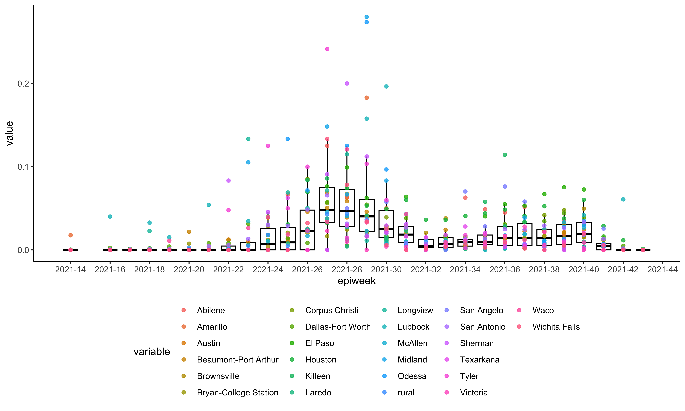
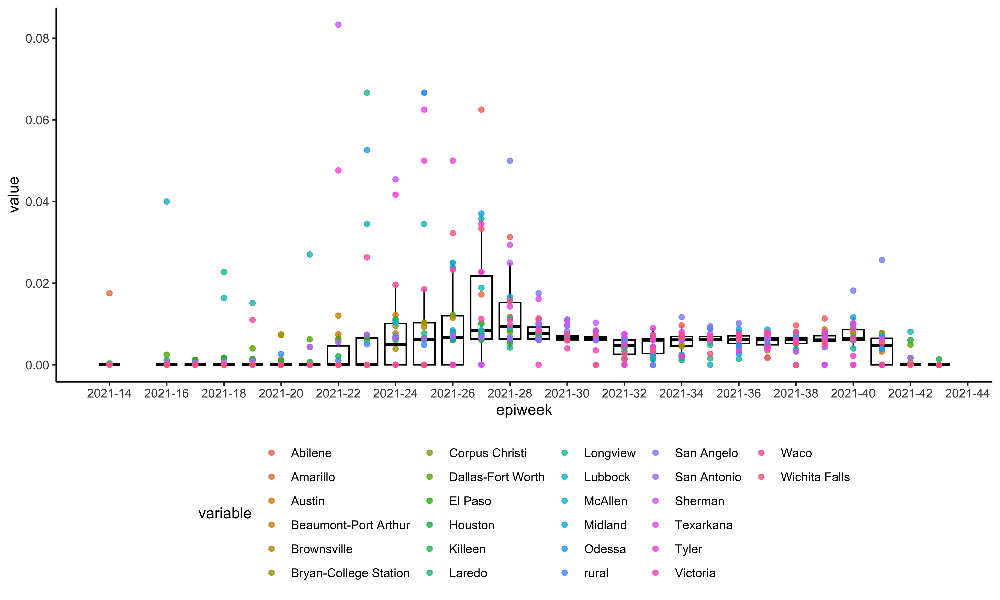

<!-- README.md is generated from README.Rmd. Please edit that file -->

# subsamplerr

<!-- badges: start -->
<!-- badges: end -->

R package for subsampling genomic data based on epidemiological time
series data.

## Installation

You can install the development version of subsamplerr from GitHub with:

``` r
devtools::install_github("leke-lyu/subsamplerr")
```

## Example

Count the number of genome samples by Epi-Week and location, and
Integrate daily count of case data into weekly count:

``` r
library(subsamplerr)

texasSeq <- texasSeqMeta %>% metaTableToMatrix(., "location", "date") %>% dateToEpiweek(.)
texasCase %<>% dateToEpiweek(.)
```

Inspect the sampling heterogeneity of the Texas dataset:

``` r
plotSequencingRatio(texasSeq, texasCase)
```



Generate sampled dataset with baseline equals 0.006

``` r
texasSample <- proposedSamplingMatrix(0.006, texasSeq, texasCase)
id <- proportionalSampling(texasSample, texasSeqMeta)
#> [1] "Given the basline equals 0.006, 5899 genomes are sampled."
#> .
#>     Dallas-Fort Worth               Houston           San Antonio 
#>                  1835                  1523                   593 
#>                 rural                Austin               McAllen 
#>                   516                   465                   113 
#>        Corpus Christi  Beaumont-Port Arthur               Killeen 
#>                   102                    84                    78 
#>           Brownsville Bryan-College Station               El Paso 
#>                    66                    60                    57 
#>               Lubbock                  Waco                 Tyler 
#>                    48                    48                    43 
#>              Amarillo                Laredo               Midland 
#>                    38                    32                    29 
#>         Wichita Falls               Sherman                Odessa 
#>                    26                    25                    24 
#>              Longview               Abilene              Victoria 
#>                    23                    22                    21 
#>             Texarkana            San Angelo 
#>                    15                    13
```

Inspect the sampling heterogeneity of the sampled dataset:

``` r
plotSequencingRatio(texasSample, texasCase)
```


